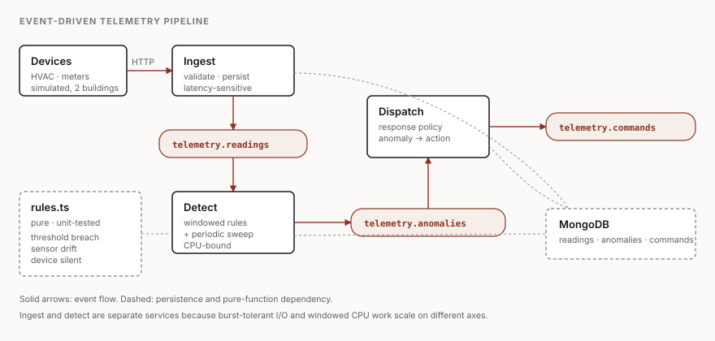

# Telemetry pipeline

An event-driven pipeline for building sensor data — ingest, detect, dispatch —
with a simulator that produces realistic HVAC and electricity-meter telemetry,
including deliberately seeded faults.

Built as a reference implementation of the architecture I use for building
management and IoT systems. Runs end to end on one machine in about a minute.



---

## Run it

```bash
docker compose up -d        # Redpanda + MongoDB
npm install
npm run dev                 # ingest, detect, dispatch, simulator
```

Within a minute or so you will see detections appearing:

```
 ! hvac-a-02 threshold_breach: 3 consecutive readings outside 20–26 celsius (latest 30.4)
-> hvac-a-02 setpoint_adjust: 3 consecutive readings outside 20–26 celsius (latest 30.4)
 ! meter-a-02 sensor_drift: Window mean 78.3 is 31% from band centre 60.0
-> meter-a-02 flag_for_inspection: Calibration suspect: Window mean 78.3 is 31% from band centre 60.0
!! hvac-b-02 device_silent: No reading for 74s (threshold 60s)
-> hvac-b-02 notify_operator: Device unreachable: No reading for 74s (threshold 60s)
```

Tests need no infrastructure at all:

```bash
npm test        # detection rules
npm run typecheck
```

---

## The shape of it

| Service | Responsibility |
|---|---|
| **Ingest** | Accepts readings over HTTP, validates, persists, publishes |
| **Detect** | Windowed rule evaluation per device, plus a periodic silence sweep |
| **Dispatch** | Turns anomalies into commands according to response policy |
| **Simulator** | Generates plausible telemetry with seeded faults |

Topics: `telemetry.readings` → `telemetry.anomalies` → `telemetry.commands`.

---

## Decisions worth explaining

The architecture is the interesting part, not the stack. Four choices and why:

### Ingest is separate from detection

These two have genuinely different shapes. Ingest is latency-sensitive and
bursty — devices retry when it is slow. Detection is CPU-bound work over a
window, and gets more expensive as rules are added.

Run them in one process and an expensive detection pass applies backpressure to
device check-ins, so you start dropping readings exactly when something
interesting is happening. Split, each scales on its own axis, and a slow
detector costs you latency on alerts rather than data loss.

### Detection sweeps on a timer, not only on messages

A dead sensor publishes nothing. A purely reactive consumer therefore never
notices it — and "the device stopped reporting" is the failure that matters most
in building management, because it is silent in every sense.

So `detect` runs a periodic sweep across all known devices regardless of
traffic. This is the single most common gap in naive telemetry pipelines.

### The rules are a pure module

[`src/detect/rules.ts`](src/detect/rules.ts) has no I/O, no broker, and takes
`now` as an argument. Everything domain-specific lives there and is unit-tested
without infrastructure; the service around it is wiring.

This is also what makes the thresholds tunable with confidence. `breachStreak: 3`
— requiring three consecutive out-of-band readings rather than one — is the
difference between a useful alert stream and one operators learn to ignore.
Sensors bounce.

### Anomalies are separate from responses

`detect` decides *what is wrong*. `dispatch` decides *what to do about it*.

They change for different reasons and on different timescales: detection
thresholds get tuned by engineers against false-positive rates, response policy
gets set by operations. Keeping them apart means neither change touches the
other's code.

---

## The simulator is part of the point

Detectors tuned against flat synthetic data fall apart on real buildings. So the
simulator models the shape real telemetry actually has:

- **Daily occupancy curve** — load rises through the morning, peaks mid-afternoon
- **Weekday / weekend split** — weekends run at roughly a third of load
- **Per-device noise** — no sensor is exactly repeatable
- **Three seeded faults**, one per detector: a unit that spikes under afternoon
  load, a meter that slowly loses calibration, and a sensor that stops reporting
  after the first simulated day

Time is compressed to one simulated hour per tick, so a full day passes in about
a minute.

Everything else behaves normally. A demo where every device is broken proves
nothing.

---

## Stack

Node 20+ · TypeScript · Fastify · Kafka (via Redpanda) · MongoDB · `node:test`

No test framework, no DI container, no message-bus abstraction layer. There is
one broker and there is no second implementation coming.

---

## What this is not

A product. There is no auth, no multi-tenancy, no retention policy and no
horizontal scaling story — all of which the production systems this is drawn
from do have. It is a readable reference for the architecture and the detection
approach, sized to be understood in one sitting.
